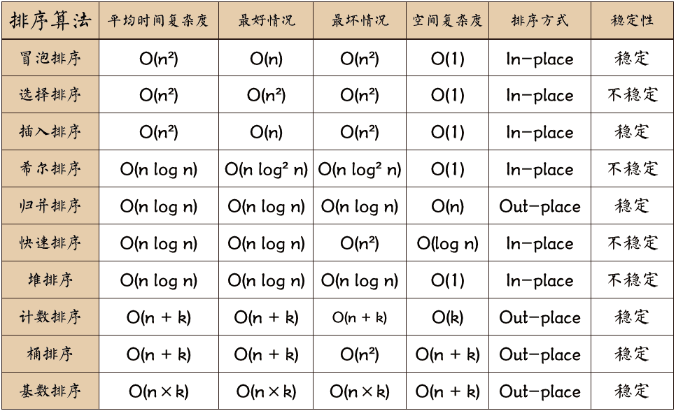

## 排序算法
常见的排序算法如下



[多写几次强化记忆](https://leetcode-cn.com/problems/sort-an-array/)

### 1. 冒泡排序
- 越小的元素会经过交换慢慢浮到数列顶端（升序）
- 过程：
   1. 从左到右遍历列表。比较相邻元素，如果第一个比第二个大，则交换
   2. 对每对相邻元素作同样操作，一趟完成后，最后元素是最大数
   3. 每次除去最后一个元素重复以上步骤
- 复杂度
  - 时间：平均 $O(n^2)$，最好$O(n)$ [需要flag标记，列表有序]，最坏$O(n^2)$ [反序]
  - 空间：$O(1)$
- js实现
    ```js
    function bubbleSort(nums) {
        let len = nums.length;
        for (let i = 0; i < len - 1; i++) {
            let flag = false; // 标记此趟是否发生数据交换
            for (let j = 0; j < len - i - 1; j++) {
                if (nums[j] > nums[j + 1]) {
                    [nums[j], nums[j + 1]] = [nums[j + 1], nums[j]]; //交换数据
                    flag = true;
                }
            }
            if (!flag) break;
        }
        return nums;
    }
    ```

### 2. 选择排序
- 每次遍历选择未排序中的最小值
- 过程：
  1. 找整个序列的最小元素，放到起始位置
  2. 在剩余未排序中选择最小元素，放到已排序的末尾
  3. 重复第二步，直到所有元素有序
- 复杂度
  - 时间：$O(n^2)$
  - 空间：$O(1)$
- js实现
    ```js
    function selectionSort(nums) {
        let len = nums.length;
        for (let i = 0; i < len - 1; i++) {
            let minIdx = i; //记录最小值索引
            for (let j = i + 1; j < len; j++) {
                if (nums[j] < nums[minIdx]) minIdx = j;
            }
            [nums[i], nums[minIdx]] = [nums[minIdx], nums[i]]; //交换数据
        }
        return nums;
    }
    ```

### 3. 插入排序
- 对已排序序列从后向前扫描，找到当前待排序数的插入位置
- 过程：
  1. 把第一个元素作为有序序列，第二个元素至最后作为未排序序列
  2. 从左到右扫描未排序序列，每个元素插入相应位置（相等放后面）
- 复杂度
  - 时间：平均 $O(n^2)$，最好$O(n)$ [列表有序]，最坏$O(n^2)$ [反序]
  - 空间：$O(1)$
- js实现
    ```js
    function insertSort(nums) {
        let len = nums.length;
        for (let i = 1; i < len; i++) {
            let j = i - 1;
            let cur = nums[i]; // 保存当前数
            while (j >= 0 && nums[j] > cur) {
                nums[j + 1] = nums[j]; // 有序数据往后挪
                j--;
            }
            nums[j + 1] = cur; // 插入
        }
        return nums;
    }
    ```

### 4. 希尔排序 [么看]
- 插入排序改良版，时间复杂度降低，但是不稳定
- 递减增量排序，分割为若干子序列分别插入排序，基本有序时，对全体再插入排序
- 过程：
  1. 确定增量序列{t1, t2,...,tk}，递减，且tk=1
  2. 对序列进行k趟插入排序
  3. 每趟排序，根据相应增量ti，分为若干长度为m的子序列，对各子序列插入排序
- 增量数列选取，常用
  
- 复杂度
  - 时间：平均 $O(nlogn)$
  - 空间：$O(1)$
- js实现
    ```js
    function shellSort(arr) {
        var len = arr.length,
            temp,
            gap = 1;
        while(gap < len/3) {          //动态定义间隔序列
            gap =gap*3+1;
        }
        for (gap; gap > 0; gap = Math.floor(gap/3)) {
            for (var i = gap; i < len; i++) {
                temp = arr[i];
                for (var j = i-gap; j >= 0 && arr[j] > temp; j-=gap) {
                    arr[j+gap] = arr[j];
                }
                arr[j+gap] = temp;
            }
        }
        return arr;
    }
    ```

### 5. 归并排序
- 分治法（递归or迭代）
- 过程：
  1. 申请大小为两个已排序列和的空间，用于存放合并后的序列
  2. 两个指针，分别指向两个已排序序列起始位置 
  3. 比较两指针元素大小，选择小的放入合并空间，移动该指针
  4. 重复3直到某指针达到序列尾
  5. 将另一序列剩余元素放入合并序列尾
- 复杂度
  - 时间：平均 $O(nlogn)$
  - 空间：$O(n)$
- js递归实现
    ```js
    function mergeSort(nums) {
        let len = nums.length;
        if (len == 1) return nums;
        let mid = Math.floor(len / 2);
        let left = nums.slice(0, mid);
        let right = nums.slice(mid);
        let orderLeft = mergeSort(left);
        let orderRight = mergeSort(right);
        let res = [];
        while (orderLeft.length || orderRight.length) {
            if (orderLeft.length && orderRight.length) {
                res.push(orderLeft[0] < orderRight[0] ? orderLeft.shift() : orderRight.shift());
            } else if (orderLeft.length) {
                res.push(orderLeft.shift());
            } else if (orderRight.length) {
                res.push(orderRight.shift());
            }
        }
        return res;
    }
    ```

### 6. 快速排序
- 分治法，将一个序列分为两个子序列
- 过程：
  1. 从序列中选择一个元素，作为基准(pivot)
  2. 将小于pivot的放在前面，大的放在后面。一次操作结束后，pivot将处于数列中间
  3. 递归将左侧和右侧的子序列排序
  4. 递归base case为序列长度为0或1时退出
- 复杂度
  - 时间：平均 $O(nlogn)$，最坏 $O(n^2)$ [有序]
  - 空间：$O(nlogn)$
- js实现
    ```js
    function quickSort(nums, low, high) {
        function partition(arr, lo, hi) {
            let pivot = arr[lo];
            while (lo < hi) {
                while (lo < hi && arr[hi] > pivot) hi--;
                arr[lo] = arr[hi];
                while (lo < hi && arr[lo] <= pivot) lo++;
                arr[hi] = arr[lo];
            }
            arr[lo] = pivot;
            return lo;
        }
        if (low < high) {
            let pivot = partition(nums, low, high);
            quickSort(nums, low, pivot - 1);
            quickSort(nums, pivot + 1, high);
        }
        return nums;
    }
    ```

### 7. 堆排序
- 借助大顶堆（升序）和小顶堆（降序）来排序
- 过程：
  1. 待排序序列建堆
  2. 将堆顶和堆尾互换
  3. 堆尺寸减一，堆顶skin
  4. 重复2-3，直到堆尺寸为1
- 复杂度
  - 时间：平均 $O(nlogn)$
  - 空间：$O(nlogn)$
- js实现
    ```js
    class MaxHeap{
        // .... 见tips.md中二叉堆的实现
        heapSort(){
            while(this.size>1){
                [this.heap[1],this.heap[this.size]]=[this.heap[this.size],this.heap[1]];
                this.size--;
                this.sink(1);
            }
        }
    }
    ```


### 8. 计数排序
- 将数据值转化为键，要求输入为有确定范围的整数
- 过程：
  1. 根据数据最大值确定桶的范围（默认处理非负整数
  2. 遍历数据填桶
  3. 遍历桶输出顺序
- 复杂度
  - 时间：平均 $O(n+k)$
  - 空间：$O(k)$
- js实现
    ```js
    function countingSort(nums, maxValue) {
        let bucket = new Array(maxValue + 1).fill(0);
        for (let i = 0; i < nums.length; i++) bucket[nums[i]]++; 
        let idx = 0;
        for (let i = 0; i < bucket.length; i++) {
            while (bucket[i] > 0) {
                nums[idx++] = i;
                bucket[i]--;
            }
        }
        return nums;
    }
    ```

### 9. 桶排序
- 计数排序升级版，每个桶根据函数映射存储一定范围的数值，再对桶内数据进行排序

### 10. 基数排序
- 非比较型整数排序算法，将整数按位数切割并比较